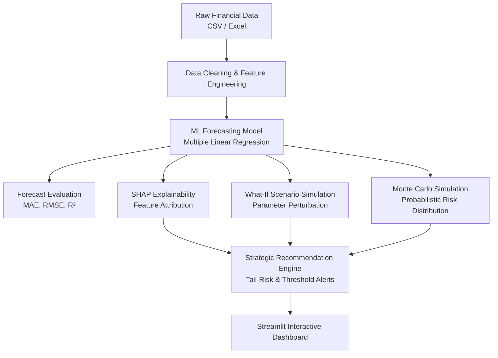

# 💰 CashFlowAI — AI-Powered Cash Flow Forecasting & Decision Support System

An intelligent financial analytics platform combining machine learning forecasting, explainable AI (XAI), what-if scenario simulations, Monte Carlo probabilistic risk modeling, and strategic decision support.

Built with **Python**, **Scikit-learn**, **SHAP**, **Plotly**, and **Streamlit**.

---

## 📌 Overview

Maintaining a healthy cash flow is critical for business continuity. **CashFlowAI** empowers financial managers, business owners, and analysts to transition from reactive cash management to proactive, data-driven financial planning.

The platform executes a complete end-to-end analytical workflow:



---

## ✨ Key Features

- **📂 User-Driven Raw Data Ingestion & Preprocessing**:
  - **Upload Raw Dataset**: Upload any raw, unprocessed operational or transactional file (`.csv`, `.xlsx`, `.xls`).
  - **Transparent Transformation**: Inspect raw data (**Step 1**) side-by-side with cleaned, normalized, and imputed data (**Step 2**) before feeding into machine learning.
  - **Automated Preprocessing**: Column alias normalization, regex currency stripping, chronological sorting, and median missing-value imputation.

- **📈 Machine Learning Cash Flow Forecasting**:
  - Multiple Linear Regression trained on historical operating features.
  - Out-of-sample evaluation with comprehensive statistical metrics:
    - **MAE** (Mean Absolute Error)
    - **RMSE** (Root Mean Squared Error)
    - **R² Score** (Coefficient of Determination)
  - Interactive Plotly visualizations comparing actual vs. predicted cash flow.

- **🔍 Explainable AI (SHAP Attribution)**:
  - Decomposes predictions using SHAP (SHapley Additive exPlanations).
  - Pinpoints which operational variables positively or negatively drive the current forecast.
  - Interactive table and bar chart for absolute and directional feature contributions.

- **🔄 What-If Scenario Analysis**:
  - Test hypothetical operational shocks (e.g., -20% drop in sales, +15% increase in expenses).
  - Instantaneous model re-inference comparing baseline vs. simulated projections.
  - Side-by-side delta metrics and impact classification (e.g., Improved, Riskier, Neutral).

- **🎲 Monte Carlo Risk Simulation**:
  - Simulates 2,000 potential outcomes modeled after empirical forecast residuals.
  - Computes exact probability of cash flow breaching the user-defined safety buffer.
  - Quantifies percentile distributions: **Mean**, **Median**, **P10 (downside risk)**, **P25**, **P75**, and **P90 (upside potential)**.

- **💡 Strategic Decision Support & Actionable Recommendations**:
  - Synthesizes forecasts, scenario impacts, and Monte Carlo downside risks (`P10`).
  - Generates clear, context-aware operational guidance (e.g., payment acceleration, debt restructuring, buffer maintenance).

---

## 📁 Project Structure

```
CashFlowAI/
├── app.py                            # Main Streamlit web application & UI tabs
├── unprocessed_data/                 # Raw, unprocessed datasets showing initial states
│   ├── raw_sec_edgar_aapl.csv        # SEC EDGAR-derived raw quarterly facts (Apple CIK 0000320193)
│   ├── raw_sec_edgar_amzn.csv        # SEC EDGAR-derived raw quarterly facts (Amazon CIK 0001018724)
│   ├── raw_sec_edgar_googl.csv       # SEC EDGAR-derived raw quarterly facts (Alphabet CIK 0001652044)
│   ├── raw_sec_edgar_msft.csv        # SEC EDGAR-derived raw quarterly facts (Microsoft CIK 0000789019)
│   ├── raw_sec_edgar_tsla.csv        # SEC EDGAR-derived raw quarterly facts (Tesla CIK 0001318605)
│   ├── raw_retail_transactions.csv   # Granular order-level retail transaction logs
│   ├── raw_uncleaned_sme_cashflow.csv# Messy accounting spreadsheet with currency symbols & NaNs
│   └── README.md                     # Data provenance, CIK taxonomy & ETL documentation
├── processed_data/                   # Cleaned, normalized, and model-ready cash flow series
│   ├── real_cashflow_aapl.csv        # Apple Inc. quarterly cash flow (2017–2026)
│   ├── real_cashflow_msft.csv        # Microsoft Corp. quarterly cash flow (2017–2026)
│   ├── real_cashflow_amzn.csv        # Amazon.com Inc. quarterly cash flow (2017–2026)
│   ├── real_cashflow_googl.csv       # Alphabet Inc. quarterly cash flow (2017–2025)
│   ├── real_cashflow_tsla.csv        # Tesla Inc. quarterly cash flow (2018–2026)
│   └── sample_cashflow_data.csv      # Default sample SME dataset with 30 periods
├── src/
│   ├── __init__.py
│   ├── data_import.py                # SEC EDGAR XBRL & Kaggle transactional ETL pipelines
│   ├── data_preprocessing.py         # Column alias mapping, regex cleaning & target derivation
│   ├── explainability.py             # SHAP explainer computation
│   ├── monte_carlo.py                # Monte Carlo distribution & threshold risk estimation
│   ├── recommendations.py            # Strategic decision rules incorporating tail-risk
│   └── scenario_analysis.py          # What-if perturbation & baseline comparison
├── SYSTEM_ARCHITECTURE.md            # Detailed system design & component specification
├── requirements.txt                  # Project dependencies
└── README.md                         # Project overview & quickstart
```

> 📖 For an in-depth technical analysis, sequence diagrams, and mathematical formulations, refer to **[SYSTEM_ARCHITECTURE.md](file:///c:/Users/BakaPrince/Documents/githubRepo/CashFlowAI/SYSTEM_ARCHITECTURE.md)**.

---

## 🚀 Getting Started

### Prerequisites

- **Python 3.10 to 3.14** installed on your system.

### 1. Clone the Repository

```bash
git clone https://github.com/bakaprince/CashFlowAI.git
cd CashFlowAI
```

### 2. Install Dependencies

```bash
pip install -r requirements.txt
```

### 3. Run the Streamlit Dashboard

```bash
streamlit run app.py
```


The application will start and open in your default browser at:
**`http://localhost:8501`**

---

## 📊 Dataset Schema

When uploading custom data, the application automatically handles column variations:

| Canonical Field | Supported Column Aliases | Description |
|---|---|---|
| `Date` | `date`, `month`, `period`, `datetime` | Observation timestamp / interval |
| `Sales` | `sales`, `revenue`, `turnover`, `net sales` | Total top-line revenue |
| `Expenses` | `expenses`, `operating expenses`, `costs` | Operating and overhead costs |
| `Receivables` | `receivables`, `accounts receivable`, `ar` | Outstanding customer payments |
| `Payables` | `payables`, `accounts payable`, `ap` | Short-term obligations to suppliers |
| `Cash Inflow` | `cash inflow`, `inflow`, `cash_inflow` | Direct cash collections |
| `Cash Outflow`| `cash outflow`, `outflow`, `cash_outflow` | Direct cash disbursements |
| `Cash Flow` | `cash flow`, `cash_flow`, `net cash flow` | *Optional*. Derived automatically as `Inflow - Outflow` or `Sales - Expenses` if omitted. |

---

## 🌐 User-Driven Data Ingestion & Preprocessing

CashFlowAI follows a strict, transparent raw-to-processed pipeline:

1. **Upload Raw Dataset**: Users upload their unprocessed operational or financial logs (`.csv`, `.xlsx`, `.xls`) via the sidebar uploader.
2. **Step 1: Raw Data Inspection**: The original dataset is preserved in memory and rendered in its exact, unaltered form.
3. **Automated Cleaning & Transformation**:
   - Column aliases normalized to canonical standards (`Sales`, `Expenses`, `Receivables`, `Payables`, `Cash Balance`).
   - Currency symbols (`$`, commas) stripped.
   - Non-standard dates parsed and sorted chronologically.
   - Missing cells imputed via median values.
   - `Cash Flow` target derived if omitted.
4. **Step 2: Cleaned Data Inspection**: Side-by-side comparison of the standardized dataset ready for machine learning.
5. **Step 3: Machine Learning & Decision Intelligence**: Model training, SHAP explainability, what-if perturbations, Monte Carlo distributions, and strategic recommendations.

---

## 🔬 Data Lineage & Test Datasets

To test the application, sample raw files are available in `unprocessed_data/`:
- `unprocessed_data/raw_uncleaned_sme_cashflow.csv`: Real-world messy SME bookkeeping sheet with currency strings, non-standard headers, and missing values.
- `unprocessed_data/raw_retail_transactions.csv`: Granular order-level transaction logs.
- `unprocessed_data/raw_sec_edgar_aapl.csv` (and AMZN, GOOGL, MSFT, TSLA): SEC EDGAR-derived raw quarterly financial statements with genuine SEC-reported facts.

Simply upload any of these files into the Streamlit sidebar uploader to experience the end-to-end data pipeline.

---

## 🛠️ Technology Stack

| Library / Tool | Purpose |
|---|---|
| **[Streamlit](https://streamlit.io/)** | Interactive Web Dashboard & UI |
| **[Scikit-Learn](https://scikit-learn.org/)** | Forecasting models & regression evaluation metrics |
| **[SHAP](https://shap.readthedocs.io/)** | Explainable AI & model feature attribution |
| **[Plotly Express](https://plotly.com/python/)** | Interactive financial charts & distributions |
| **[Pandas](https://pandas.pydata.org/)** | Data ingestion, sanitization & manipulation |
| **[NumPy](https://numpy.org/)** | Matrix computations & Monte Carlo sampling |
| **[Matplotlib](https://matplotlib.org/)** | Statistical feature importance visualizations |
| **[OpenPyXL](https://openpyxl.readthedocs.io/)** | Support for Excel spreadsheet uploads |

---

## 📄 License

This project is licensed under the MIT License - see the repository details for more information.
