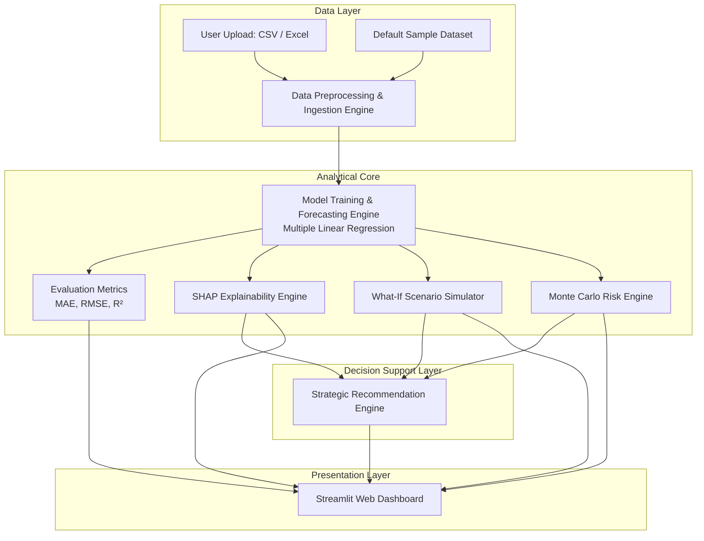
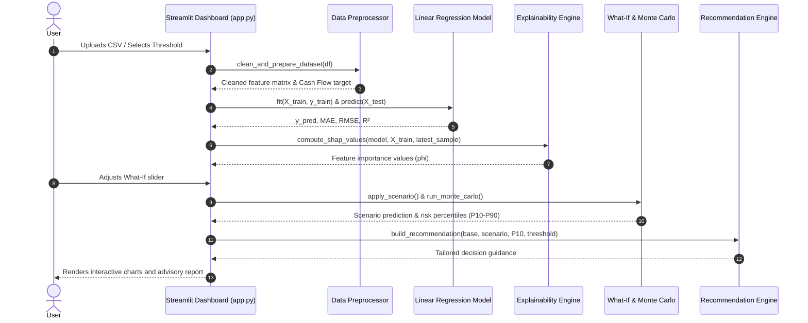

# 🏗️ CashFlowAI — System Architecture

This document provides a comprehensive technical overview of the architecture, design principles, component interactions, mathematical foundations, and data pipelines underlying the **CashFlowAI** platform.

---

## 1. High-Level Architecture Overview

CashFlowAI follows a modular, pipeline-based architecture designed for high interpretability, responsive user interactions, and clean separation of concerns.

---

## 2. Component Breakdown

### 2.1 Data Ingestion & Preprocessing (`src/data_preprocessing.py`)
Responsible for sanitizing disparate financial spreadsheets into a standardized tabular format.
- **Canonical Alias Resolution**: Maps divergent enterprise accounting labels (e.g., `net sales`, `turnover`, `revenue`) to canonical fields (`Sales`, `Expenses`, `Receivables`, `Payables`, `Cash Inflow`, `Cash Outflow`, `Cash Flow`).
- **Data Cleansing**: Strips currency characters (`$`, `₹`, `€`), removes thousand-separator commas, converts timestamps into `pd.Timestamp`, and enforces strict numeric typings.
- **Target Derivation**: If the target column `Cash Flow` is missing, it dynamically infers it using either direct cash accounting (`Cash Inflow - Cash Outflow`) or accrual approximations (`Sales - Expenses`).
- **Temporal Alignment**: Orders observations chronologically and handles missing values using historical column medians.

### 2.2 Forecasting Engine (`app.py` & Scikit-Learn)
Generates reliable baseline cash forecasts without the black-box opacity of deep neural networks.
- **Algorithm**: Multiple Linear Regression (`sklearn.linear_model.LinearRegression`).
- **Chronological Split**: Enforces an 80/20 train-test split without data shuffling (`shuffle=False`), preventing data leakage across temporal boundaries.
- **Performance Evaluation**:
  - **MAE** (Mean Absolute Error): Average magnitude of forecast errors in currency units.
  - **RMSE** (Root Mean Squared Error): Penalizes larger variance deviations.
  - **R² Score**: Quantifies the percentage of variance explained by the model features.

### 2.3 Explainability Engine (`src/explainability.py`)
Demystifies model behavior using game-theoretic Shapley values via **SHAP**.
- **Linear Explainer**: Calculates exact additive attribution scores for each operational feature:
  $$\hat{y}(x) = \phi_0 + \sum_{i=1}^{M} \phi_i$$
  where $\phi_0$ is the base expected value, and $\phi_i$ is the marginal contribution of feature $i$.
- **Decision Visibility**: Identifies which metrics serve as primary cash drivers or drains for the latest accounting period.

### 2.4 What-If Scenario Simulator (`src/scenario_analysis.py`)
Enables forward-looking scenario testing and financial sensitivity analysis.
- **Perturbation Logic**: Modifies selected variables by user-controlled percentage deltas ($\pm 50\%$).
- **Inference Comparison**: Evaluates the altered operational vector through the trained model and compares predicted outcomes against the baseline:
  $$\Delta = \hat{y}_{\text{scenario}} - \hat{y}_{\text{baseline}}$$
- **Categorization**: Automatically labels scenario health as *Improved*, *Riskier*, or *Neutral*.

### 2.5 Monte Carlo Risk Simulation (`src/monte_carlo.py`)
Quantifies financial uncertainty by modeling forecasting error distributions.
- **Residual Modeling**: Computes residual variance $\sigma = \text{std}(y_{\text{test}} - \hat{y}_{\text{test}})$.
- **Stochastic Sampling**: Generates $N = 2,000$ Gaussian random walks centered around the point prediction:
  $$CF_{\text{sim}} \sim \mathcal{N}\left(\hat{y}_{\text{base}}, \sigma^2\right)$$
- **Shortfall Probability**: Computes the exact probability that cash flow dips below the user-specified safety threshold $T$:
  $$P(CF < T) = \frac{1}{N} \sum_{k=1}^{N} \mathbb{I}(CF_k < T)$$
- **Percentile Distributions**: Evaluates $P_{10}$ (downside risk), $P_{25}$, $P_{50}$ (median), $P_{75}$, and $P_{90}$ (upside potential).

### 2.6 Strategic Recommendation Engine (`src/recommendations.py`)
Synthesizes forecasting, scenario, and probabilistic tail-risk metrics into operational guidelines.
- **Rule Hierarchy**:
  1. **Threshold Breach**: Alerts if the what-if scenario projects cash flow lower than the required safe buffer $T$.
  2. **Tail-Risk Exposure**: Warns if the $P_{10}$ outcome from Monte Carlo simulation falls below $T$, even if expected cash flow appears positive.
  3. **Operational Softening**: Notes minor downward adjustments that remain within safe bounds.
  4. **Stable Positioning**: Validates strong capital adequacy and recommends investment pacing.

### 2.7 Interactive Dashboard Layer (`app.py` & Streamlit)
Provides an intuitive, tabbed interface organized around decision workflows:
1. **📊 Data**: Dataset preview and descriptive statistics.
2. **📈 Forecast**: Historical trajectory, predicted curve, and regression performance metrics.
3. **🔍 Explainability**: Tabular and graphical SHAP attribution rankings.
4. **🔄 What-If**: Dynamic sliders for sensitivity simulation and delta visualization.
5. **🎲 Risk Simulation**: Empirical histogram distribution with threshold and median markers.
6. **💡 Recommendation**: Decision support summary and actionable advisory alerts.

---

## 3. End-to-End Sequence Diagram

---

## 4. Key Design Principles

1. **Interpretability Over Complexity**: Rather than opaque black-box neural networks, the system leverages linear models paired with SHAP attributions, ensuring financial stakeholders can audit every decision.
2. **Defense in Depth for Data Ingestion**: Accounts for real-world accounting inconsistencies (misformatted dates, currency symbols, varying column conventions).
3. **Probabilistic Risk-Awareness**: A single point prediction is insufficient for treasury planning; pairing point forecasts with Monte Carlo percentile distributions ($P_{10}$, $P_{90}$) provides robust margin-of-safety analysis.
4. **Zero-Lockin Lightweight Footprint**: Completely self-contained, requiring no external databases or cloud API keys. Runs locally or containerized in seconds.
